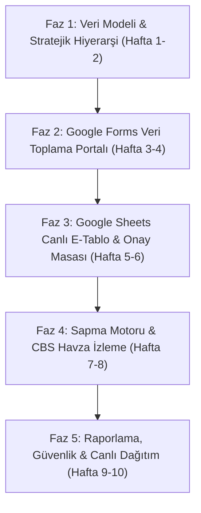

# Ulusal Su Planı (2026–2035) İzleme ve Değerlendirme Bilgi Sistemi (USP-İDS)
## Sıfırdan Kurgulama Ana İş Planı ve Mimari Yol Haritası (Master Plan & Blueprint)

---

### 1. Giriş ve Yeniden Kurgulama Vizyonu

İşbu iş planı; **T.C. Tarım ve Orman Bakanlığı Su Yönetimi Genel Müdürlüğü (SYGM)** koordinasyonunda yürütülen ve **Ulusal Su Kurulu (USUK)** kararları uyarınca uygulanan **Ulusal Su Planı (2026–2035)** kapsamındaki **8 Hedef, 31 Strateji ve 141 Eylemin** izlenmesi için geliştirilecek **USP-İDS** sisteminin sıfırdan kurumsal, ölçeklenebilir ve modern yazılım mimarisiyle yeniden hayata geçirilmesini hedefler.

#### Neden Sıfırdan Yeniden Kurgulama?
1. **Kurumsal Entegrasyon Derinliği:** Tek sayfalık prototipten, DETSİS birim kodları ve Ulusal Su Bilgi Sistemi (USBS) ile çift yönlü konuşabilen kurumsal bir mimariye geçiş.
2. **Kullanıcı Deneyimi Paradigması:** 
   * **Veri Giriş Ajanı:** Kurum kullanıcıları için karmaşadan uzak, anket basitliğinde **Google Forms** mantığı.
   * **Analiz ve Onay Ajanı:** Süpervizör ve kurul karar vericileri için canlı hücre düzenleme, filtreleme ve toplu işlem yeteneğine sahip **Google Sheets** mantığı.
3. **Mekânsal Doğruluk (CBS/GIS):** 25 Nehir Havzası ve 81 İl Su Kurulu kararlarını gerçek coğrafi katmanlarla (PostGIS/GeoJSON) bağlayan mekânsal izleme.

---

### 2. Önerilen Teknoloji Mimarisi

```
+-----------------------------------------------------------------------------------+
|                           KULLANICI ARAYÜZÜ (FRONTEND)                            |
|  - Next.js 15 (React 19 / TypeScript) / Modern SPA                                |
|  - Tailwind CSS + Radix UI / Shadcn (Bakanlık ve DETSİS Tasarım Standartları)    |
|  - Modül A: "Veri Giriş Formu" (Google Forms Mantığı - react-hook-form + zod)      |
|  - Modül B: "Canlı İzleme E-Tablosu" (Google Sheets Mantığı - TanStack Table v8)  |
|  - Modül C: "CBS Havza Haritası" (Leaflet / MapLibre GL - 25 Nehir Havzası)      |
+-----------------------------------------------------------------------------------+
                                         │  HTTPS / REST / WebSocket
                                         ▼
+-----------------------------------------------------------------------------------+
|                           UYGULAMA SUNUCUSU (BACKEND)                             |
|  - FastAPI (Python 3.12+) / Async Engine & OpenAPI 3.1 Dokümantasyonu             |
|  - Erken Uyarı & Sapma Analitik Motoru (Trafik Işığı Algoritması: Yeşil/Sarı/Kırmızı)|
|  - SHA-256 Kanıt Doğrulama ve Belge İmzalama Motoru                              |
|  - RBAC Yetkilendirme & e-Devlet Kapısı / OAuth2 Entegratörü                       |
+-----------------------------------------------------------------------------------+
                                         │  SQLAlchemy 2.0 / PostGIS
                                         ▼
+-----------------------------------------------------------------------------------+
|                           VERİ VE ENTEGRASYON KATMANI                            |
|  - PostgreSQL 16 + PostGIS (İlişkisel ve Mekânsal Veritabanı)                     |
|  - DETSİS API Konektörü (Kurum/Birim hiyerarşisi)                                 |
|  - USBS (Ulusal Su Bilgi Sistemi) Çift Yönlü REST Senkronizasyonu                |
|  - Immutable Audit Log (Zaman Damgalı Değiştirilemez Denetim İzi)                 |
+-----------------------------------------------------------------------------------+
```

---

### 3. Fazlandırılmış Yol Haritası (Implementation Roadmap)



---

#### 📌 FAZ 1: Temel Veri Modeli ve Stratejik Hiyerarşi (Hafta 1 – 2)
* **Kapsam:** Veri tabanı şemasının PostgreSQL standardında kurulması, 8 Hedef, 31 Strateji ve 141 Eylemin tohum verilerinin (seed data) yüklenmesi.
* **Geliştirilecek Bileşenler:**
  1. `hedef`, `strateji`, `eylem`, `gosterge` ilişkisel tabloları.
  2. DETSİS birim hiyerarşisi tablosu (`kurum`, `alt_birim`, `detsis_no`).
  3. Kurum-Eylem sorumluluk matrisi (`*` Koordinatör, İlgili Kurum).
  4. Gösterge türleri tanımı:
     * **Sayısal / Kümülatif** (İstasyon sayısı, tesis adedi)
     * **Oransal %** (Su kaybı oranı, tedbir tamamlanma yüzdesi)
     * **Kilometre Taşı / Milestone** (Mevzuat yayımı, sistem kurulumu)
* **Teslimat:** Veritabanı migrasyonları (Alembic), RESTful Hiyerarşi API'si (`/api/v1/hierarchy`).

---

#### 📌 FAZ 2: Google Forms Mantığında Veri Toplama Portalı (Hafta 3 – 4)
* **Kapsam:** İlgili kurumların (DSİ, İSKİ, ASKİ, ÇŞİDB vb.) karmaşık tablolarla uğraşmadan, adım adım veri girebileceği anket arayüzü.
* **Geliştirilecek Bileşenler:**
  1. **Dinamik Kart Yapısı:** Seçilen eyleme göre gösterge tipi, birimi, hedefi otomatik yüklenen form kartları.
  2. **Kanıt Belgesi Yükleme Zorunluluğu (FR-04):** Resmi yazı, Resmi Gazete sayısı, onaylı rapor yükleme alanı.
  3. **Kriptografik Bütünlük (SHA-256):** Yüklenen her kanıt dosyasının hash değerinin anında hesaplanması.
  4. **Otomatik Tamamlama & DETSİS Doğrulama:** Kurum/birim seçiminde hızlı arama.
  5. **Taslak Olarak Kaydetme:** Kurum personelinin veriyi kaydedip daha sonra resmi onaya sunabilmesi.
* **Teslimat:** İstemci tarafı Form Arayüzü, `/api/v1/submissions` REST endpoint'leri.

---

#### 📌 FAZ 3: Google Sheets Mantığında Canlı E-Tablo ve Onay Masası (Hafta 5 – 6)
* **Kapsam:** Yöneticilerin, koordinatör kurumların ve denetçilerin tüm verileri bir elektronik tablo rahatlığında izleyip yönetmesi.
* **Geliştirilecek Bileşenler:**
  1. **E-Tablo Izgarası (Grid):** Sütun başlıkları (`A, B, C...`), satır numaraları (`1, 2, 3...`) ve formül çubuğu (`fx =ORTALAMA(G2:G15)`).
  2. **Çoklu Sayfalar (Tabs):**
     * `Form Yanıtları (Canlı Akış)`
     * `141 Eylem İzleme Matrisi`
     * `Su Kurulları Kararları (USUK / Havza / İl)`
     * `Kurumsal Performans & Skor Kartı`
  3. **Hücre İçi Doğrudan Onay (Inline Status Chips):** Açılır menü ile `Onaylandı`, `Sorumlu Onayında`, `İade` durumlarının doğrudan güncellenmesi.
  4. **Koşullu Biçimlendirme (Conditional Formatting):** Tamamlananlar yeşil, gecikenler kırmızı, riskliler sarı renk kodlaması.
  5. **Dışa/İçe Aktarma:** Tek tıkla Excel/CSV dışa aktarım ve toplu filtreleme.
* **Teslimat:** Canlı E-Tablo Modülü, WebSocket/Polling senkronizasyonu, Toplu İşlem API'si.

---

#### 📌 FAZ 4: Sapma Analitiği, Erken Uyarı ve CBS Havza Modülü (Hafta 7 – 8)
* **Kapsam:** Süresi yaklaşan veya hedefin gerisinde kalan eylemler için erken uyarı motoru ve havza bazlı harita görselleştirmesi.
* **Geliştirilecek Bileşenler:**
  1. **Sapma Motoru (FR-06):**
     $$\text{Teorik İlerleme (\%)} = \frac{\text{Geçen Süre}}{\text{Toplam Plan Süresi}} \times 100$$
     * 🟢 **Yeşil:** Gerçekleşme $\ge$ Teorik İlerleme.
     * 🟡 **Sarı:** Kalan süre $< 6$ ay ve Gerçekleşme $< 50\%$.
     * 🔴 **Kırmızı:** Bitiş yılı aşılmış veya kritik sapma.
  2. **CBS / Havza Harita Katmanı (FR-07):** 25 Nehir Havzası sınırları (GeoJSON), havza bazlı tamamlanma oranları ve öncelikli su sorunları kartları.
  3. **Su Kurulları Karar Takip (FR-05):** USUK, 25 Havza ve 81 İl Su Kurulu kararlarının eylemlerle eşleştirilmesi ve *"Uygulamaya geçen karar oranı"* metriği.
* **Teslimat:** Analitik motoru (`engine/analytics.py`), Harita Arayüzü (`components/BasinMap.tsx`).

---

#### 📌 FAZ 5: Raporlama, Güvenlik, USBS ve Canlı Yayına Alma (Hafta 9 – 10)
* **Kapsam:** 2 yıllık resmi gözden geçirme raporları, kurumsal güvenlik, USBS entegrasyonu ve Vercel/Kurumsal ortama dağıtım.
* **Geliştirilecek Bileşenler:**
  1. **İki Yıllık Resmî Değerlendirme Raporu (FR-08):** Cumhurbaşkanlığı ve USUK standartlarında tek tıkla A4/PDF brifing çıktısı.
  2. **Rol Bazlı Yetkilendirme (RBAC) & e-Devlet:** Süpervizör, Koordinatör Kurum `*`, Paydaş Kurum, Kurul Sekreteryası rolleri.
  3. **Değiştirilemez Denetim İzi (Audit Trail - NFR-04):** IP, kullanıcı, eski/yeni değer zaman damgalı loglama.
  4. **USBS Entegrasyon Arayüzü:** REST API aracılığıyla Ulusal Su Bilgi Sistemi ile veri eşitleme.
  5. **Prodüksiyon Dağıtımı:** Docker konteynerleri, CI/CD GitHub Actions, Vercel (`usp-ids.vercel.app`) ve kurumsal sunucu kurulumu.
* **Teslimat:** Üretim ortamı sürümü, Sistem Kullanım Kılavuzu ve Teknik Şartname Uygunluk Belgesi.

---

### 4. Teknik Şartname Uygunluk Matrisi

| Şartname Maddesi | Modül | Karşılanma Yöntemi | Faz |
|---|---|---|---|
| **FR-01** Stratejik Hiyerarşi | Hiyerarşi Modülü | 8 Hedef, 31 Strateji, 141 Eylem ağaç yapısı ve arama | Faz 1 |
| **FR-02** Kurum Matrisi | DETSİS & Kurum Masası | Koordinatör (`*`) ve ilgili paydaş DETSİS kodları | Faz 1 |
| **FR-03** Dinamik Göstergeler | Form Motoru | Sayısal, Oransal %, Kilometre Taşı dinamik giriş tipleri | Faz 2 |
| **FR-04** Kanıt Yönetimi | Belge Deposu | SHA-256 hash doğrulamalı belge yükleme | Faz 2 |
| **FR-05** Karar Takip | Su Kurulları Modülü | USUK, 25 Havza, 81 İl Su Kurulu kararları ve uygulama oranı | Faz 4 |
| **FR-06** Sapma & Erken Uyarı | Analitik Motoru | 🟢 Yeşil, 🟡 Sarı, 🔴 Kırmızı trafik ışığı erken uyarı | Faz 4 |
| **FR-07** CBS & Havza | CBS Harita Modülü | 25 Nehir Havzası mekânsal poligonları ve renk skalası | Faz 4 |
| **FR-08** Otomatik Rapor | Raporlama Motoru | 2 yıllık resmi brifing formatı (PDF/Yazdırılabilir A4) | Faz 5 |
| **NFR-01** Güvenlik & RBAC | Kimlik Katmanı | Rol Bazlı Yetkilendirme, e-Devlet uyumu, TLS 1.3 | Faz 5 |
| **NFR-04** Audit Log | Denetim İzi | Değiştirilemez işlem günlüğü tablosu | Faz 5 |

---

### 5. Karara Bağlanacak Kritik Mimari Tercihler

Aşağıdaki mimari tercihler kullanıcı onayına sunulmaktadır:

1. **Frontend Tercihi:**
   * **Seçenek A (Önerilen - Next.js 15 / TypeScript):** Modern, bileşen tabanlı, Vercel (`usp-ids.vercel.app`) üzerinde sunucu taraflı hız ve mükemmel SEO/performans.
   * **Seçenek B (Hafif SPA - Vite + React / TypeScript):** İstemci tarafında çalışan, statik host (GitHub Pages) ve FastAPI backend ile uyumlu hafif mimari.
2. **Backend Mimarisi:**
   * **Seçenek A (Python FastAPI):** Analitik hesaplamalar, veri işleme ve makine öğrenmesi algoritmaları için ideal.
   * **Seçenek B (Next.js Serverless Routes):** Tek bir kod tabanında (Full-stack TypeScript) API ve UI bir arada barındırma.
3. **Veritabanı Barındırma:**
   * **Seçenek A (PostgreSQL + PostGIS):** Tam mekânsal CBS sorguları ve kurumsal üretim veritabanı (Supabase / Neon / Kurumsal PostgreSQL).
   * **Seçenek B (Hibrit SQLite + JSON Katmanı):** Sıfır kurulum maliyetli hızlı prototip ve yerel test altyapısı.
