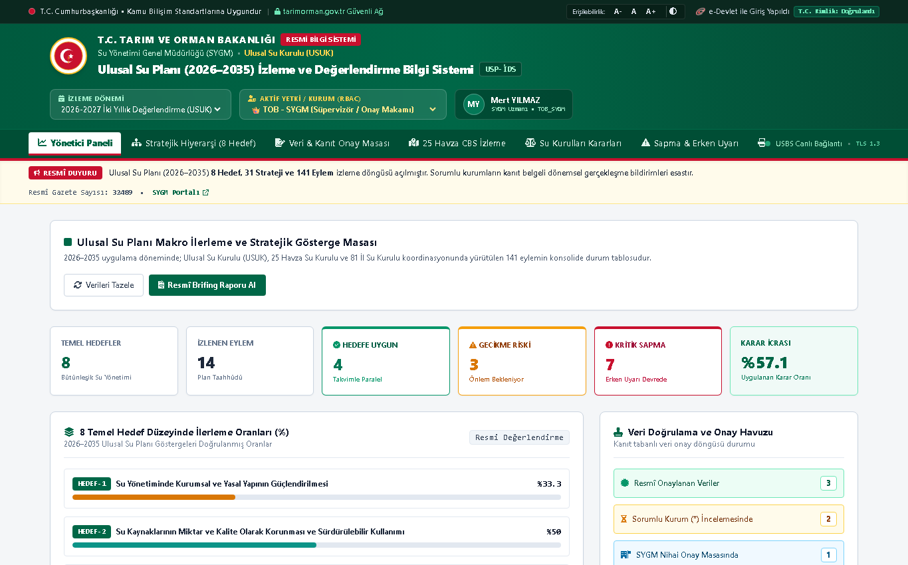

# Ulusal Su Planı (2026–2035) İzleme ve Değerlendirme Bilgi Sistemi (USP-İDS)

**T.C. Tarım ve Orman Bakanlığı Su Yönetimi Genel Müdürlüğü (SYGM)** koordinasyonunda yürütülen ve **Ulusal Su Kurulu (USUK)** kararları doğrultusunda hazırlanan **Ulusal Su Planı (2026–2035)** kapsamındaki **8 Hedef, 31 Strateji ve 141 Eylemin** çevrim içi izlenmesi, doğrulanması ve raporlanması amacıyla geliştirilmiş kurumsal izleme bilgi sistemi.



---

## 🏛️ Kurumsal Kimlik ve Kamu Bilişim Standartları

* **Bakanlık Standartları:** [tarimorman.gov.tr](https://www.tarimorman.gov.tr) kurumsal tasarım dili, resmî bakanlık yeşili (`#006747`) ve T.C. kırmızısı (`#c8102e`).
* **Erişilebilirlik (WCAG 2.1):** Yazı boyutu ayarlayıcı (`A-`, `A`, `A+`) ve Yüksek Karşıtlık (High-Contrast) modu.
* **e-Devlet Kapısı:** Rol Bazlı Yetkilendirme (RBAC - SYGM Süpervizör, Sorumlu Kurum `*`, İlgili Kurum, Kurul Sekreteryası, USUK Karar Verici).
* **USBS Entegrasyonu:** Ulusal Su Bilgi Sistemi (USBS) RESTful API servisleri üzerinden çift yönlü veri akış mimarisi.

---

## 🌟 Sistem Modülleri (Şartname Fonksiyonel İsterleri)

* **FR-01 (Stratejik Hiyerarşi Modülü):** 8 Hedef, 31 Strateji ve 141 Eylem hiyerarşik akordiyon ağacı; arama ve filtreleme.
* **FR-02 (Çok Paydaşlı Kurum Matrisi):** Bakanlıklar, DSİ, ÇŞİDB, TRGM, MGM, SUKİ'ler (ASKİ, İSKİ, İZSU), Belediyeler ve Üniversiteler.
* **FR-03 (Dinamik Gösterge Tipleri):** Sayısal/Kümülatif, Oransal (%) ve Kilometre Taşı (Milestone/Boolean) metrikleri.
* **FR-04 (Kanıt Tabanlı Belge Yönetimi):** SHA-256 bütünlük imzalı kanıt yükleme (Resmî Gazete sayısı, onaylı rapor, tutanak, CBS katmanı).
* **FR-05 (Su Kurulları Karar Takip):** Ulusal Su Kurulu (USUK), 25 Havza Su Kurulu ve 81 İl Su Kurulu kararları; *"Uygulamaya geçen karar oranı"* hesaplama motoru.
* **FR-06 (Sapma Analizi ve Erken Uyarı Motoru):** Teorik ilerleme ile gerçekleşen gösterge değeri kıyaslaması (🟢 Yeşil, 🟡 Sarı, 🔴 Kırmızı durum kodlaması).
* **FR-07 (CBS ve Havza Bazlı Mekânsal Görünüm):** 25 Nehir Havzası CBS kartları, havza koruma öncelikleri ve gerçekleşme oranları.
* **FR-08 (İki Yıllık Resmî Değerlendirme Raporu):** Plandaki 2 yıllık periyotlara uygun, Cumhurbaşkanlığı ve USUK formatında tek tıkla yazdırılabilir resmî brifing çıktısı.
* **NFR-04 (Denetim İzi / Audit Trail):** Değiştirilemez, zaman damgalı işlem günlüğü.

---

## 🚀 Kurulum ve Çalıştırma

### Gereksinimler
* Python 3.10+
* `fastapi`, `uvicorn`

### Bağımlılıkları Yükleme
```bash
pip install fastapi uvicorn
```

### Uygulamayı Başlatma
```bash
python -m uvicorn main:app --host 127.0.0.1 --port 8080 --reload
```

* **Web Portalı:** [http://127.0.0.1:8080](http://127.0.0.1:8080)
* **Swagger API Dokümantasyonu:** [http://127.0.0.1:8080/docs](http://127.0.0.1:8080/docs)

---

## 📁 Proje Dosya Yapısı

```
usp-ids/
├── database.py                 # SQLite/PostgreSQL ilişkisel veri tabanı şeması ve tohum verileri
├── engine.py                   # Erken uyarı algoritması, sapma motoru ve analitik hesaplayıcılar
├── main.py                     # FastAPI REST API servisleri ve iş akışı kontrolcüsü
├── usp_ids.db                  # Örnek tohumlanmış veri tabanı
├── screenshot_tarimorman.png   # Portala ait arayüz önizlemesi
├── static/
│   ├── index.html              # tarimorman.gov.tr kurumsal standartlarında responsive HTML5
│   ├── style.css               # Bakanlık renk paleti, erişilebilirlik ve A4 yazdırma şablonu
│   └── app.js                  # RBAC yetki yönetimi, onay masası ve asenkron veri motoru
├── .gitignore                  # Git hariç tutma kuralları
└── README.md                   # Dokümantasyon
```

---

## ⚖️ Lisans ve Haklar
© 2026 T.C. Tarım ve Orman Bakanlığı • Su Yönetimi Genel Müdürlüğü (SYGM)
